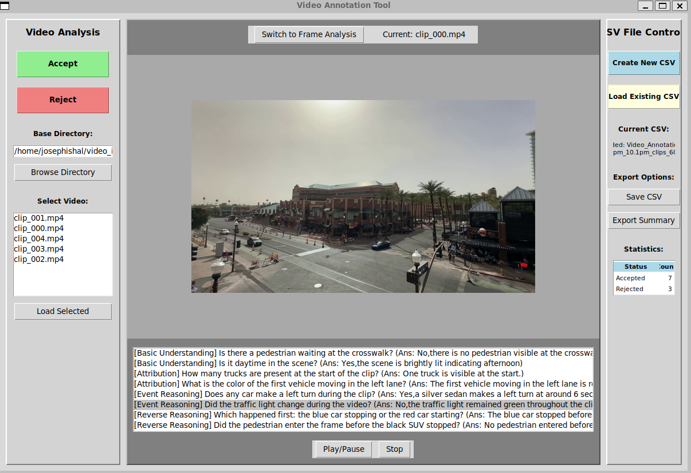

# Video QA annotation tool 
Once the questions and answers are generated this tool can be used to accept and reject the questions, a rudimentary tool that was designed for easier verification

### Tool usage
` devbox run video_annotator`

Note : ReadMe and tool  are still being updated