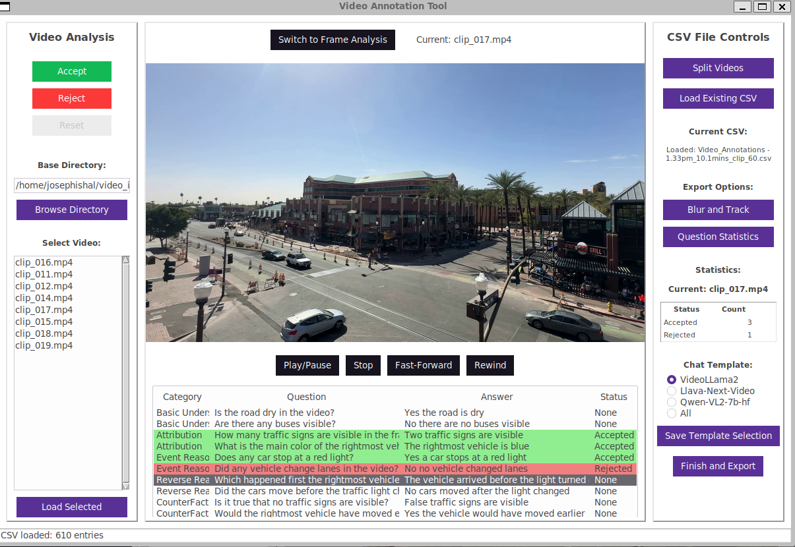

# Video QA annotation tool

Once the questions and answers are generated this tool can be used to accept and reject the questions, a rudimentary tool that was designed for easier verification



## Prerequisites

For Windows systems:

- [WSL](https://learn.microsoft.com/en-us/windows/wsl/install)
- [Devbox](https://www.jetify.com/devbox)

For Linux/MacOS:

- [Devbox](https://www.jetify.com/devbox)

If there is with tkinter installation (outside the devbox shell)

```
sudo apt-get install python3-tk
```

## Setup and Usage

To set up the SAM model:

```bash
devbox run sam-download
```

To run the tool:

```bash
devbox run video_annotator
```

# Features

## 📊 [Question Statistics](./UserGuide/QuestionStats.md)

Check generated questions and categorize them into accepts and rejects. Rejected questions can be edited directly in the tool. View comprehensive statistics about questions, answers, and types available in the loaded CSV file.

## ✅ [Accept and Reject Questions](./UserGuide/ManualAnnotation.md)

Efficiently review and categorize generated questions with an intuitive interface for quality control.

## 🎬 [Manual Video Analysis](./UserGuide/VideoAnalysis.md)

Perform detailed video analysis with full playback controls including play, pause, stop, forward, and rewind functionality. Switch to frame-level analysis to manually pick and annotate individual frames.

## ✂️ [Video Splitting](./UserGuide/VideoSplit.md)

Split large video files (over 10 seconds) into manageable 10-second clips for easier processing and annotation.

## 🔒 [Blur and Track Functionality](./UserGuide/BlurTrack.md)

Manually blur select regions of the video to address privacy and ethical concerns while maintaining the integrity of the dataset.

## 📤 [Export to Chat Template](./UserGuide/ExportChat.md)

Export cleaned and annotated datasets into VLLM-ready templates including VideoLLaMA2, LLaVA-Next-Video, and Qwen-VL2 formats for seamless integration with downstream applications.

## 🤝 Contributing

For contributing to this project find details [here](./UserGuide/Contribution.md)

## License

<a rel="license" href="http://creativecommons.org/licenses/by-sa/4.0/"></a><br />This work is licensed under a <a rel="license" href="http://creativecommons.org/licenses/by-sa/4.0/">Creative Commons Attribution-ShareAlike 4.0 International License</a>.
