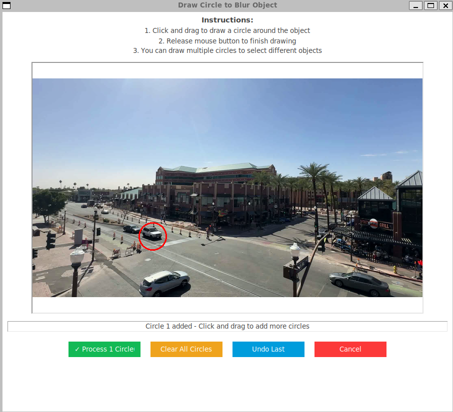

# Blur and Track Feature



The blur and track feature allows users to selectively blur specific regions of videos, making it ideal for privacy protection by obscuring license plates, faces, or other sensitive information.

## How It Works

1. **Click "Blur and Track"** button to launch the selection interface
2. **Interactive Circle Drawing** - A specialized interface opens with clear instructions:
   - Click and drag to draw a circle around the target object
   - Release mouse button to finish drawing
   - Draw multiple circles to select different objects
   - Use control buttons to manage your selections

## Interface Controls

### Drawing Controls

- **Click & Drag**: Draw circles around objects to blur
- **Multiple Selection**: Add as many circles as needed for different objects
- **Visual Feedback**: Real-time circle drawing with size indicators

### Management Controls

- **Clear All Circles**: Remove all drawn circles and start over
- **Undo Last**: Remove the most recently drawn circle
- **Process Video**: Begin the blur and track operation
- **Cancel**: Exit without processing

## Technical Implementation

The feature uses advanced AI models for precise object tracking and segmentation:

### **SAM (Segment Anything Model)**

- Provides accurate object segmentation within selected circles
- Creates precise masks for irregular object shapes
- Ensures natural-looking blur boundaries

### **YOLO (You Only Look Once)**

- Real-time object detection and classification
- Tracks object movement across video frames
- Maintains consistent tracking even with object movement

### **Predictive Tracking Algorithm**

The system uses a sophisticated predictive approach to minimize lag:

```pseudocode
ALGORITHM: Predictive Blur and Track

INITIALIZATION:
1. Load SAM and YOLO models
2. Extract first frame from video
3. For each user-drawn circle:
   - Run YOLO detection to find matching objects
   - Generate initial SAM mask for precise segmentation
   - Initialize tracking data (position, velocity, bbox)

MAIN PROCESSING LOOP:
For each frame in video:

   STEP 1: PREDICT (No lag - uses previous frame data)
   - Calculate predicted position using current velocity
   - Move mask to predicted location
   - Apply blur using PREDICTED position

   STEP 2: DETECT (Parallel processing)
   - Run YOLO detection on current frame
   - Find best matches for tracked objects

   STEP 3: UPDATE (Refine for next frame)
   - Update actual object positions
   - Calculate new velocity: velocity = 0.7 * old_velocity + 0.3 * movement
   - Update SAM mask every 3 frames or on large movements
   - Handle lost objects with fallback tracking

   STEP 4: WRITE FRAME
   - Write blurred frame to output video

COMPLETION:
- Save processed video with "_predictive_blur_Nobjects.mp4" suffix
- Display processing statistics and object tracking results
```

## Key Features

### **Predictive Processing**

- **Zero Lag Blurring**: Blur is applied using predicted positions, eliminating visual lag
- **Smooth Tracking**: Velocity-based prediction ensures consistent object following
- **Adaptive Masking**: SAM masks update dynamically for changing object shapes

### **Robust Object Handling**

- **Multi-Object Support**: Track and blur multiple objects simultaneously
- **Lost Object Recovery**: Continues tracking even when objects are temporarily obscured
- **Fallback Mechanisms**: Maintains tracking when YOLO detection fails

### **Performance Optimizations**

- **GPU Acceleration**: Utilizes CUDA when available for faster processing
- **Selective Updates**: SAM masks update only when necessary to save computational resources
- **Memory Management**: Efficient handling of large video files

## System Requirements

- **GPU Recommended**: CUDA-compatible GPU for optimal performance
- **SAM Model**: Automatically downloads required checkpoint (sam_vit_h_4b8939.pth)
- **YOLO Model**: Uses YOLOv8n (lightweight version)
- **Memory**: Sufficient RAM for video processing (varies by video size)

## Output

- **Processed Video**: Saved with descriptive filename indicating number of tracked objects
- **Quality**: Maintains original video resolution and frame rate
- **Statistics**: Displays tracking success rate and processing details

## Sample Output

[](https://www.youtube.com/watch?v=61R9yc--DII)

_Click the image above to watch a demonstration of the blur and track functionality in action._

## Use Cases

- **Privacy Protection**: Blur faces and license plates in dash cam footage
- **Data Anonymization**: Prepare videos for public release or research
- **Selective Censoring**: Hide specific objects while preserving video content
